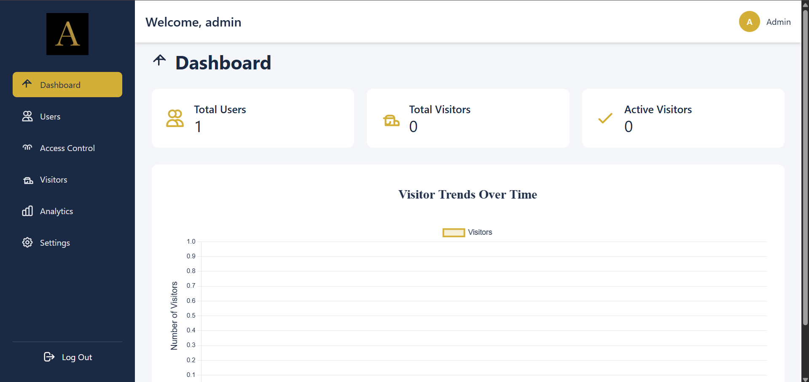
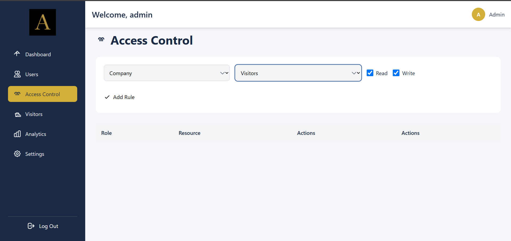
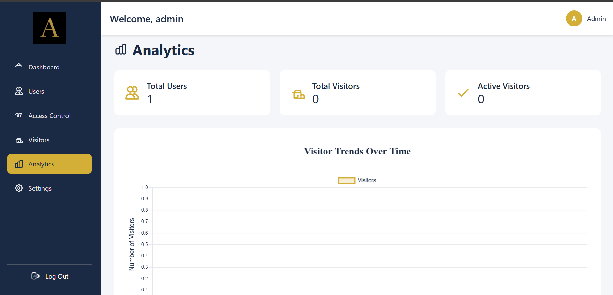
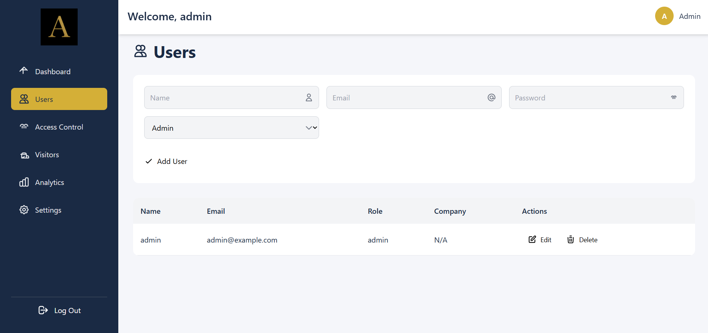
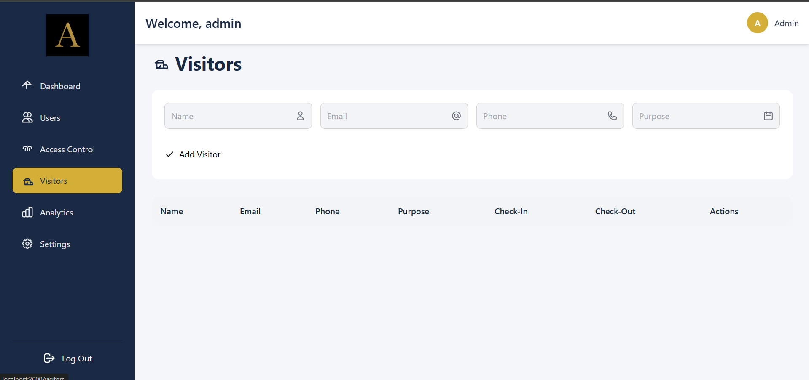
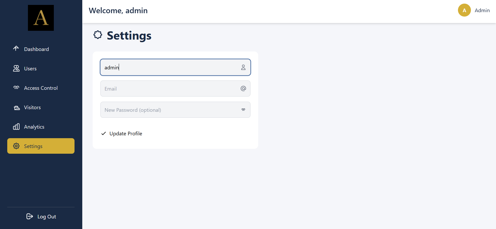

# 💻 Visitor Management System – Frontend (MERN + Tailwind)

This is the **frontend** of a SaaS-based Visitor Management System built with **React.js** and **Tailwind CSS**. It includes authentication, multi-company login, and role-based dashboards for Admins and Receptionists.

---

## 🎯 Features

- 🧑‍💼 Login system for multiple companies
- 🛡️ Role-based access (Admin / Receptionist)
- 🌐 API connection to backend
- 🎨 Fully responsive UI with Tailwind CSS

---

## ⚙️ Tech Stack

- React.js
- Tailwind CSS
- Axios for API requests
- React Router

---

## 🔧 Environment Setup

Create a `.env` file in the `frontend/` root:

```env
REACT_APP_API_URL= localhost:3000
⚠️ Do not commit .env to GitHub. Add it to .gitignore.
```

▶️ Running Frontend

npm install
npm start
Runs the app on http://localhost:3000.

🔗 Backend
👉https://github.com/Arya4546/vms-backend


## 📸 Screenshots

### 🔐 Login Page


### 🏠 Dashboard


### 🛡️ Access Control


### 📊 Analytics


### 👥 Users Management


### 🧾 Visitors Management


### ⚙️ Settings


